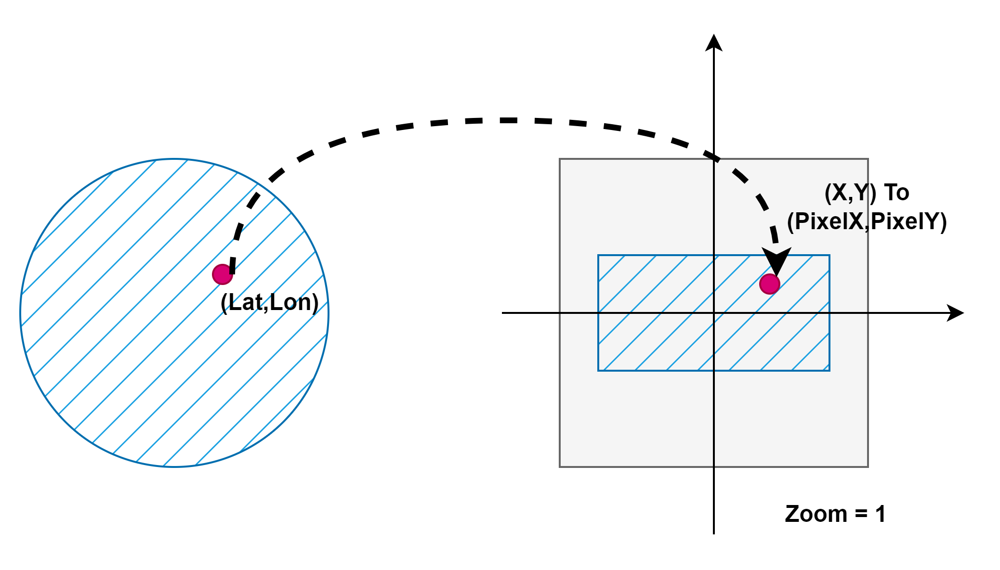

# Ch01: Core Concept
## 1. Cooridinates

> References (本内容参考了如下链接)：
> - [GoogleMap 地图和图块坐标](https://developers.google.com/maps/documentation/javascript/coordinates?hl=zh-cn)
> - [Leafletjs ZoomLevels](https://leafletjs.com/examples/zoom-levels/)
> - [Bing Maps Tile System](https://learn.microsoft.com/en-us/bingmaps/articles/bing-maps-tile-system)

- 浮点型精度表示的坐标系-世界坐标系(worldCoordinate 坐标与当前缩放级别无关，即与屏幕像素不严格对应)：
  - 经纬度表示的坐标系：Latitude and longitude values, which reference a point on the world uniquely. (We use the World Geodetic System WGS84 standard.)
  - （二维）世界坐标系：World coordinates, which reference a point on the map uniquely.
- 整型精度表示的坐标系-像素坐标系(pixelCoordinate 坐标与屏幕像素空间存在一一对应的关系)：
  - 像素坐标系：Pixel coordinates, which reference a specific pixel on the map at a **specific zoom level**. 同时支持经纬度渲染与坐标拾取。
  - 图块坐标系：Tile coordinates, which reference a specific tile on the map at a **specific zoom level**. 主要用于管理地图瓦片的管理，结合视口以实现按需加载。
- 视口（ViewWindow）：
  - 视口指的是真正渲染地图内容并呈现给用户的区域，例如某一固定大小的举行Div。系统会根据指定的地图中心点（采用 LatLng 形式）缩放级别和外围 DOM 元素的大小来构造视口，并将此边界框转换为像素坐标。

$$pixelCoordinate = worldCoordinate * 2^zoomLevel$$

