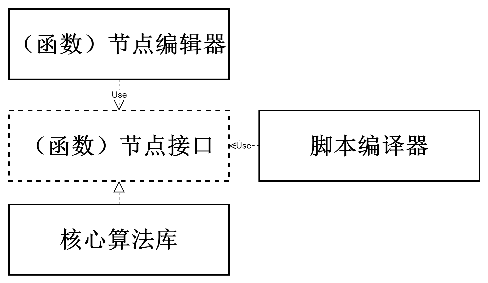
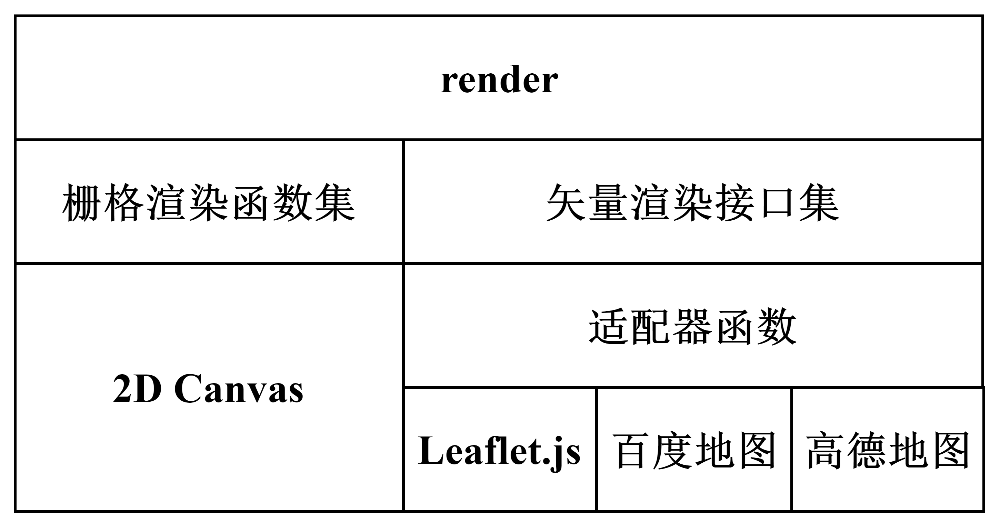
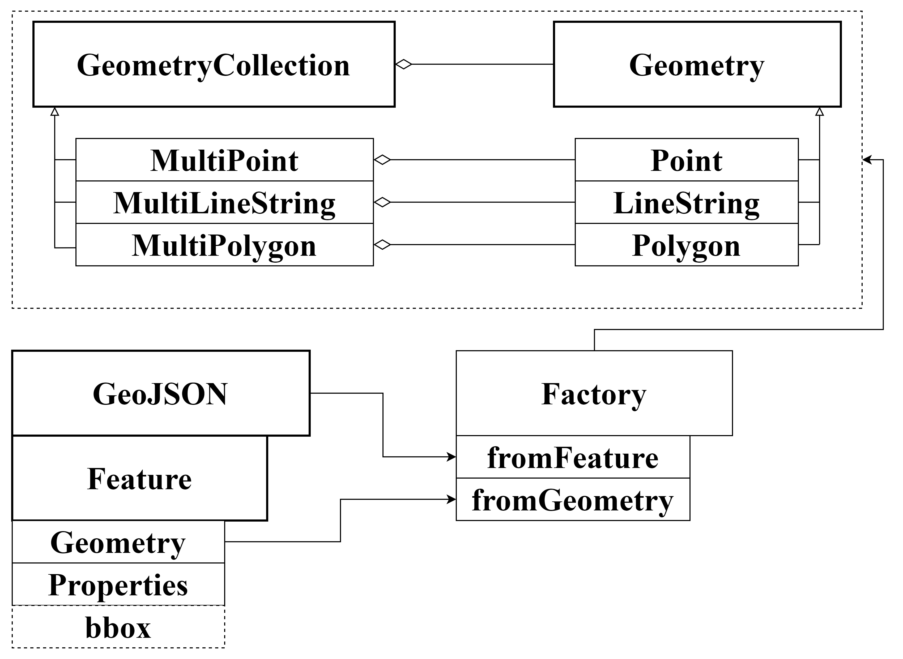

# 第三章 项目总体结构安排与基础算法设计

## 3.1 项目总体结构安排

本项目由脚本编辑模块（包括节点编辑器、代码编辑器）、脚本编译及执行模块、核心算法模块、可视化与交互模块组成。用户不仅可以使用代码编辑器来直接编写函数式数据分析处理脚本，还可以使用节点编辑器进行交互式低代码脚本编辑。用户脚本建模为混合了数据流和控制流的有向无环图（Directed Acyclic Graph）。脚本编译器接受用户脚本，解析并转换为浏览器可直接执行的代码，执行代码返回结果或报错信息。数据管理组件维护一个惰性渲染循环，当地图中需要显示的数据发生变更，则触发地图显示更新。同样的，用户与地图的交互也会导致数据变更，此时会逆向触发导致代码重新执行以更新结果数据。

节点编辑器会提供系列具有特定数据格式的输入输出节点，这些节点本质上是一组用于描述特定数据转换能力的接口，脚本编译器参照接口名，根据设计好的策略将节点图转换为可以直接运行的代码。

## 3.2 核心算法库模块结构

本项目的核心是一套使用 TypeScript 语言开发的、独立于用户界面的核心算法库。在基础之上，本项目合理利用现代浏览器技术开发出界面，实现各种基础功能及高级分析功能。

算法库本身由众多具模块组成，这些模块又可以根据依赖关系划分出不同的层级，下图是粗略的模块示意图，纵向上存在依赖关系。算法库可以分为基础与分析两个部分：

  - 核心模块（core）：用于实现事件系统、类集成系统等与具体算法无关但与项目设计模式的实现高度相关的核心代码，是整个代码库的核心。
  - 数学模块（math）：该模块专注于纯数学场景下的算法，实现了一套空间矢量计算函数集、单位球球面量测函数集及复数计算（用于傅立叶分析）函数集以及单位换算函数集。可以通过联合本模块与地理模块实现地球表面的量测，得益于这样的低耦合设计，用户甚至可以十分方便地实现其他非地星球的量测函数集。
  - 数据交换模块（dataIO）：该模块负责数据解析、数据格式转换、内部对象生产等功能。目前支持 GeoJSON 文件、TopoJSON 文件读取与输出。通过实现对应的接口，用户也可以根据需要使用其他算法包来拓展该模块的功能。
  - 地理模块（geo）：
  
  该模块由地理坐标系子模块（CRS）与投影子模块（Projection）组成。地理坐标系子模块提供不同坐标系下的投影转换函数、距离及面积计算函数，earth 基类为半径为 6371000 米的正球体。投影子模块具体实现正逆向投影函数，可按需拓展。

  - 栅格数据模块（coverage）：该模块维护一个用于表示多波段遥感影像数据的三维数组、一个用于记录对应波段栅格统计值的缓存字典以及一个基于四叉树的（可选择性构建）影像金字塔。栅格统计值缓存字典采用“惰性求值，动态更新”的设计思路，只用户调用栅格类提供的统计函数时才会开始计算并缓存对应波段的统计值，一旦缓存字典内存在统计值该类就会细粒度动态维护该统计值。
  - 地理矢量几何体模块（geometry）：参考 GeoJSON 最新标准，实现 GeoJSON 对象的读取、修改与输出。该模块用于描述用户可以操纵的地理几何对象，是地理信息系统交互、信息交换等功能实现的核心。该模块通过抽象类、继承及接口机制，在保证代码简洁的同时提供优越的可拓展性。
  - 渲染模块（render）：
    
    该模块分为两个部分，栅格数据渲染函数集及矢量数据渲染接口集。栅格数据的渲染基于浏览器的 Canvas 标签原生实现，不依赖外部库。矢量数据渲染，考虑到灵活性，将对矢量数据的渲染能力抽象为系列接口。
  - 分析部分（Analysis）：该部分对矢量数据构建拓扑并在此基础上实现网络分析、聚类分析和三角网构建。另外，该部分还针对栅格数据实现了系列分析功能。

## 3.3 基础算法设计
1. 内部地理几何体对象类

根据 GeoJSON 标准，geometry 模块抽象出 Geommetry 及 GeometryCollection 两个基类，前者派生出 Point、Lingstring 及 Polygon 子类，后者派生出 MultiPoint、MultiLinestring 及 MultiPolygon 子类。GeometryCollection 及其子类均由 Geommetry 的子类聚合而成。上文提及的每一个类均有对应的工厂函数，工厂函数接受 GeoJSON 对象或 GeoJSON 对象的 Geometry 属性对象，按照一定规则生产内部地理几何体对象，对于复杂嵌套的 GeometryCollection 及 FeatureCollection 则会递归调用工厂函数，完成对象解析与初始化工作。

2. 坐标转换与量测算法

参照公式（1.2 章节的公式编号），本项目实现了球面墨卡托的正逆向投影函数。考虑到地球是一个球体，而我们已经有了在球面坐标系与平面坐标系之间转换的投影函数，量测算法的实现就有两个基本方向：1）直接在球面计算；2）将所有待量测坐标投影至笛卡尔平面再使用平面几何计算；本项目在数学模块中实现了以下函数：

- 量测球面上两点间距离可以使用 haversine 公式：
  $$ a = \sin^2(\frac{\Delta\phi}{2}) + \cos(\phi_1) \cos(\phi_2) \sin^2(\frac{\Delta\lambda}{2}) $$
  $$ c = 2 \cdot \arctan2(\sqrt{a}, \sqrt{1-a}) $$
  $$ d = R \cdot c $$
  - 其中 $R$ 为地球半径，$\phi$ 为纬度，$\lambda$ 为经度。

- 量测球面上两点间面积可以使用球面三角形面积公式：
  $$ A = R^2 \cdot (\alpha + \sin(\alpha) \cdot \cos(\beta) - \beta) $$
  - 其中 $\alpha$ 为两点间的弧长，$\beta$ 为两点间的角度。

也可以经纬度坐标投影至平面后，再使用平面几何计算。

- 量测平面上多边形面积可以使用 Shoelace 公式：
  $$ A = \frac{1}{2} \left| \sum_{i=0}^{n-1} (x_i y_{i+1} - x_{i+1} y_i) \right| $$
  - 其中 $n$ 为多边形顶点数，$(x_i, y_i)$ 为多边形顶点坐标。

## 3.4 基础算法实验验证