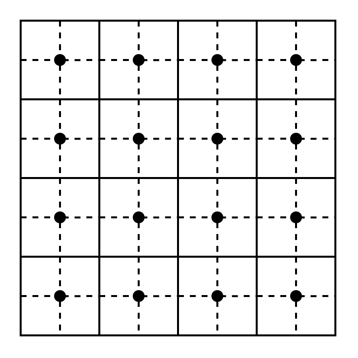

# 算法章节

## 栅格路径规划算法设计
路径规划算法一般针对图（由节点和弧段组成）所表示的路网数据进行（单源、多源）最小代价路径生成。求解最短路径的算法对于处理栅格数据也十分有用，例如我们可以根据地形数据计算水流路径等。如果我们将栅格数据视作一种特殊的图，则可以复用针对一般节点图的路径规划算法来处理栅格数据。栅格数据可以根据需要转化为每个节点都是四连通的图，同样的，某一栅格与其邻接栅格连通的权值可以根据某一规则由已有的栅格值计算出来。

对于一般的图表示的路网数据，我们至少有两点认识：1）距离：从图中一个节点到另一个节点的代价，代价越大距离越远。2）方向：从起点指向终点的向量可作为路径取舍的度量指标。对于栅格数据，我们还可以根据其特性做出特别的优化，比如在栅格中的代价可以使用经过的栅格数来表达，这样就可以避免使用高复杂度的代价计算函数。

由简单到复杂的路径规划算法可以大致分为三个种类：1）广度优先搜索(Breadth First Search)：在所有方向上均匀遍历数据，碰到障碍物后再躲避。2）全局代价查询(Uniform Cost Search)：该算法会选择使得整体代价最小的路径（例如 Dijkstra 算法），提前规避障碍物。3）启发式算法：例如 A* 算法，该算法是针对某一特定的方向使用启发式函数优化的 Dijkstra 算法，极端情况下会退化为 Dijkstra 算法。该算法会综合考虑障碍物的分布、终点方位等因素。

### 1. 广度优先搜索(Breadth First Search)
该算法追踪一个不断扩大的边界节点队列，对于栅格而言该过程也可以叫做漫水填充(flood fill)。该过程可以使用如下伪代码表达：

**函数：** BFS(graph, start)
**输入：**
* graph: 由节点和边组成的图
* start: 起始节点
**输出：**
* reached: 所有可达节点的集合
**步骤：**
1. 初始化队列 `frontier` 和集合 `reached`
2. 将 `start` 加入 `frontier` 和 `reached`
3. 循环执行以下步骤，直到 `frontier` 为空：
    * 从 `frontier` 中取出一个节点 `current`
    * 遍历 `current` 的所有邻居 `next`
        * 如果 `next` 不在 `reached` 中：
            * 将 `next` 加入 `frontier` 和 `reached`
            * （可选择的某种操作）

对于栅格数据，使用该过程可以构造向量场（将当前栅格与下一个访问到的栅格以键值对的方式存储），也可以构造距离场栅格（根据访问顺序累加栅格值），后续可以根据这些中间结果计算最短路径。对于终点已经确定的情况，我们可以再遇到终点时就推出搜索以减少计算。该过程对于一般的节点图路网也是有效的。另外，该过程并为考虑加权的情况，仅将经过的栅格数对应为距离（代价）。

### 2. 全局代价查询(Uniform Cost Search)
对于一般的节点图路网数据，我们可以赋予边权值，例如路况复杂的边可能要耗费更多的代价。对于栅格数据，也可以根据栅格值来为栅格间的连接边定权，例如，对于数字高程模型，连通极高值或极低值栅格的连接边权值会更大，对应了现实中翻山越岭会付出更高代价。优化全局代价是 Dijkstra 算法的核心思想，在广度优先搜索的过程中计算距离场，择优记录路径即可实现该算法。

## References
- 移动正方形: https://en.wikipedia.org/wiki/Marching_squares
- A 星: https://www.redblobgames.com/pathfinding/a-star/introduction.html
- word 伪代码：https://zhuanlan.zhihu.com/p/472381746